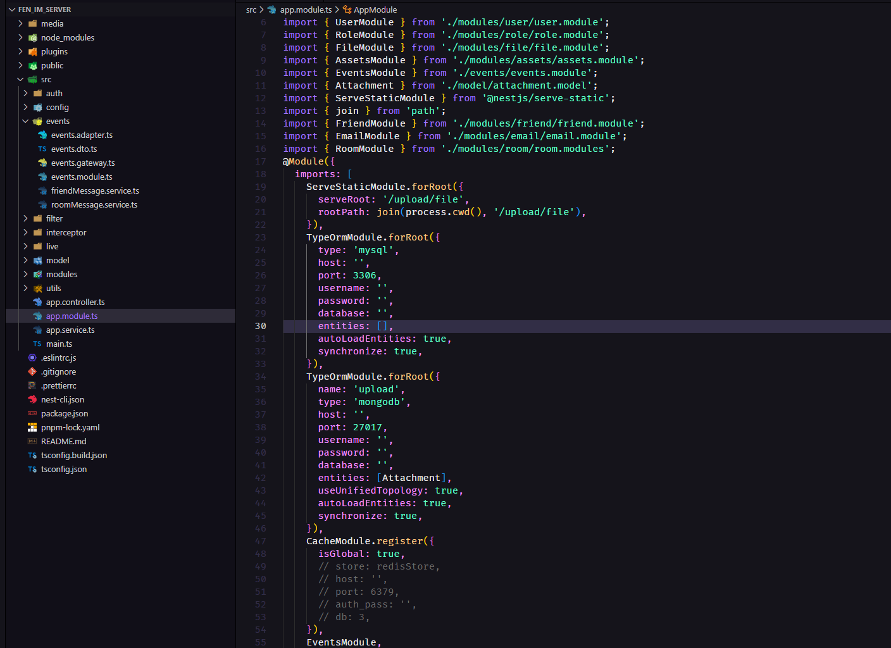
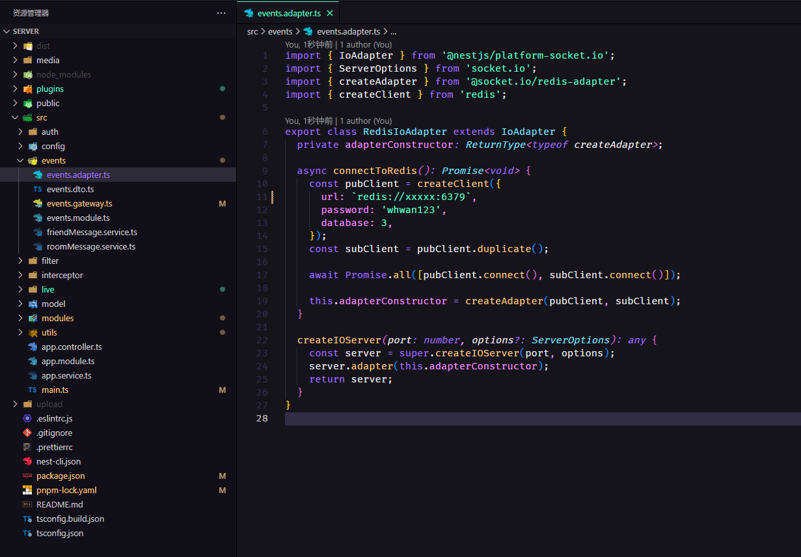

# Fen-im-server

### 使用 nest,socket.io,开发的简单聊天服务
### 该项目[前端地址](https://github.com/whwanyt/fen_im_pc)

1.修改配置

 2.运行

```
npm start:dev
```

[nest 中文文档地址](https://docs.nestjs.cn/8/techniques?id=%e6%95%b0%e6%8d%ae%e5%ba%93)
